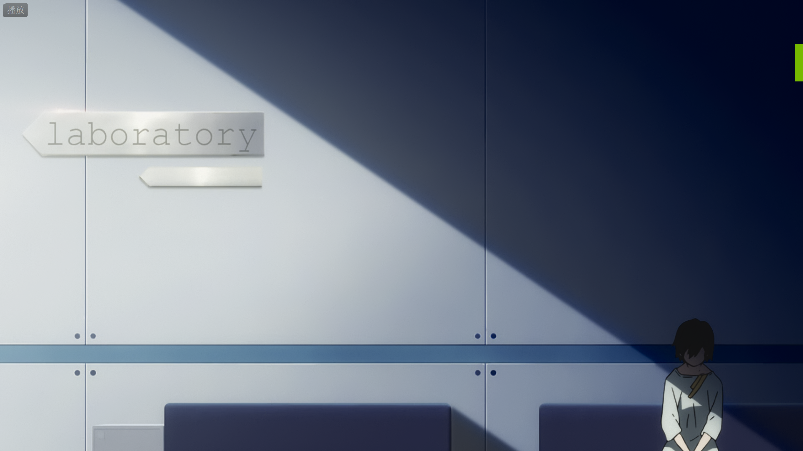
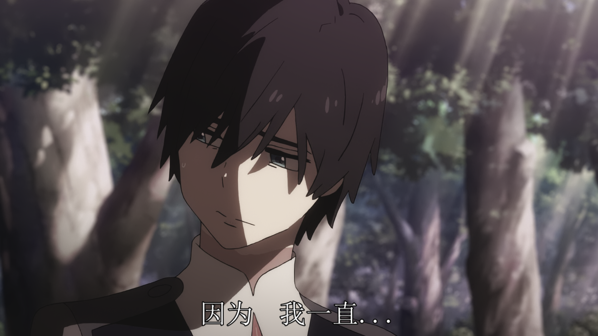
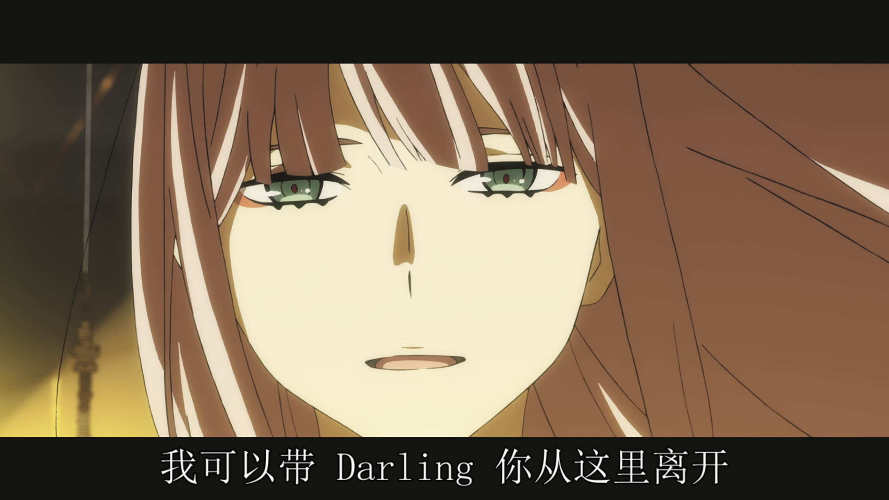
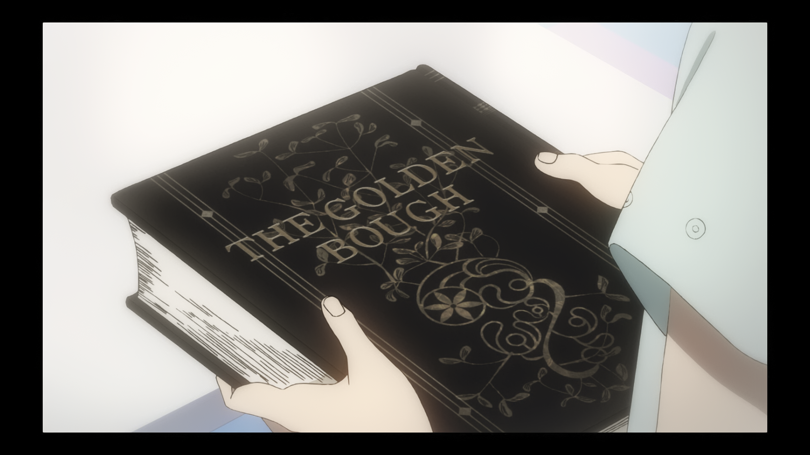

`TRIGGER`可算是我最喜欢的动画工作室了，当时在`Youtube`上刷到`DARLING in the FRANXX`
之后着实让我兴奋了好一阵，可能只有跑去北极这和白熊玩拍拍脑袋才能让我冷静下来。看看那串长长的看着就能让人血脉偾张的staff，看看预告片那华丽的作画，美少女开萝卜，好耶。
<!--break-->

可惜看完就又是另一回事了。

首先就是糟糕的音乐和音响。OP很好，我就是喜欢中岛美嘉姐姐。`DitF`
的OP是由HYDE写的，vocal是中岛美嘉，做了两版PV，分别以红蓝作为主色调，同时配上中岛美嘉那种华丽，摇滚，黑暗，嗓音中气不足带着一点慵懒的唱腔，可以说是完全戳中我的性癖。顺带一说，`Kiss of Death`
这张EP还顺带了HYDE和中岛美嘉13年前为`NANA`创作的`Glamorous Sky`，还是那个味儿，就是正。而ED则是由杉山胜彦提供，vocal是`XX:me`
，也算是日本动画传统艺能了，给cv们组个团起个名字像是什么偶像然后没多久就解散。杉山胜彦是锦织敦史请来的，我感觉就是因为锦织敦史太喜欢乃木坂46，而杉山胜彦就是给乃木坂46写歌的，完全是公费追星。杉山胜彦足足写了6首ED，详细可以看anitama的[访谈](http://www.anitama.cn/article/ceed074dbb4c977f)
。但是我完全搞不懂音乐的橘麻美和音响监督秦昌二。这种萝卜太空幻想曲就是改配泽野弘之那种恢弘的电子管弦乐，能够很好渲染出末世感和战争的紧张感，而且泽野弘之找vocal的能力也是一绝。橘麻美的配乐就单调得不行，在该响的时候像蚊子叫，在该紧张的时候像是吊诡的不行，完全气氛错位嘛，实在不行的时候就拿OP和ED凑数。纵观锦织哥哥参与过的作品都没怎么在音乐上拉过的，除开泽野弘之，还有`The Pillows`
，`TeddyLoid`，`岩崎琢`，`末广健一郎`，`鹭巢诗郎`。不能省的还是省不得啊。

接下来是画面上，非常用心地使用了大量画幅的切换。`DitF`使用大量2.35：1的超宽画幅来强调剧情。

同时光影安排也非常出色。

> `labboratory`被斜过来的光照射，广主席的脑袋却在阴影中。

> 广主席的脸被光线切割，突出了心中的反复与挣扎。

电影镜头语言的使用十分地丰富，可以说是暴打萌豚动画了，普通动画的叙事简直不如直接去看小说，特别还大量使用了电影画幅，其实拍电影的理论都辣么成熟了你说这些动画人咋都不学学呢。

而战斗就像是一个回合制游戏，我还以为他们在精灵宝可梦决斗呢。是我的回合，然后队友们只会在边上像看电影一般嗑瓜子看戏闲聊，什么你和我说今石洋之是动作检修？`DitF`那豪华的staff不会都是挂名的吧，不会吧不会吧。

剧情上的问题就更多了，锦织敦史的想法太多可是能力没跟上。节奏拖沓，表达突兀，缺乏张力，bug频出。又想搞群像剧又想搞校园青春恋爱剧还想要反乌托邦社会反思元素，最后一通操作结果一个都没有做好。

- 在第13集可以发现02之前并不知道广主席是儿时带她跑路的那个人，那么之前02是在干什么？培养备胎？甚至还可以教教除了Kiss之外的事情？但是02之前为什么会这么表现呢？

> 02带广主席第一次打破规矩。这里不像是能够对备胎可以说出的话，所以这里有一个很明显的矛盾。（这里我真的是急死了，广主席你倒是答应啊）

- 整个主角团除了02完全没有主见，除了服从`爸爸`完全没有一种能够称得上目标的东西，甚至驾驶萝卜是为了获得`爸爸`的赏识，就仿佛是`EVA`中碇真嗣为了获得父亲的注意而去搭载初号机。可是主角们一个个大大咧咧的，不像真嗣那样内向，懦弱，迷茫，喜欢逃避。主角们就仿佛不会思考一般，随波逐流，但是锦织却想要表达他们是独特的，是不同的，是反抗的急先锋，简直失败至极。

- 同时又体现了另外一个问题，设定过于想当然而且充满矛盾，和那些网络哲学家一个思路。人类获得永生就会失去欲望？渴求永生不就是欲望吗？使用机器刺激大脑快乐不也是对于快乐的欲望吗？失去欲望的Virm却还有把宇宙同化的欲望？这种设定上的问题就像是夏天的蚊子一般又多又烦人，在你的耳旁嗡嗡叫。

- 结尾反派一转攻势变成了友军，这是`TRIGGER`的老毛病了。但是不同的是之前的作品都足够优秀可以掩盖这个问题，而且他们的侧重点都不在这方面。但是`DitF`作为一个想要探讨问题侧重点在于剧情的作品来说，这就是一个永远无法被补上的窟窿。

- 对于02的描写也是非常突兀，就算看不到02带广主席出逃那看看他们反目成仇也是好的呀。广主席都说出你就是个怪物这种话了，难道不是要崩坏的开始吗？可是之后02突然仿佛换了一个人一般，跟着主角团被命运所淹没，再也不是那个个性很强的反叛角色了，这就是嫁狗随狗吗？

- 其他的问题就不一一赘述了，不然我可以列到锦织哥哥退出业界。

不过我发现一些书：

- 孩子们居住的地方叫做`槲寄生`，而`榭寄生`的枝叶也被叫做`生命的金枝`，而第十三集中02与广主席的出逃也是逃到了一株榭寄生下。熟悉欧洲习俗的人会知道，在榭寄生下的吻不能被拒绝，哈利·波特与暗恋的女孩儿秋·张的第一次接吻就是在槲寄生下。同时`DitF`也受了`金枝：巫术与宗教之研究`的影响，这是一个日本动画经常出现的元素，在访谈中也提到了关于驾驶服的设计包含了大量关于`仪式感`与`巫女`的元素。

> 在第12集中这本书也出现了

- `巴德尔`。在`DitF`中使用的那个词`Mistilteinn`不仅仅有`榭寄生`的意思，同时还表示由`榭寄生`的枝条变化而成的`长青剑`。`巴德尔`意为"盛开的花"，他的父亲是主神奥丁，母亲是神后弗丽嘉。在诗人史洛里的《新艾达》中写道，因为`巴德尔`感受到了死亡的阴影时，他的母亲让万物发下誓言不可伤害巴德尔，唯唯落下了长在英灵殿东边的`榭寄生`，因为太弱小了。邪神洛基平时就非常嫉妒代表光明的`巴德尔`，当他得知这件事情的时候，就诱导`巴德尔`的弟弟目盲的霍德尔把`榭寄生`的树枝化成的剑，也就是`长青剑`，掷向`巴德尔`，`巴德尔`因此死亡。于是，整个世界都陷入了黑暗。`巴德尔`被葬在了`灵舡（Hringhorni）`中，也就是`APE`建造的那艘船，可能是意指文明的葬礼吧。

- 最后一集的标题取自石黑一雄的`Never Let Me Go`

- 在B站发现的[关系](https://www.bilibili.com/read/cv1637514/)。

- 在豆瓣发现的[花与鸟的隐喻](https://movie.douban.com/review/9225938/)

`Never Let Me Go`和`金枝`加入待读清单。
